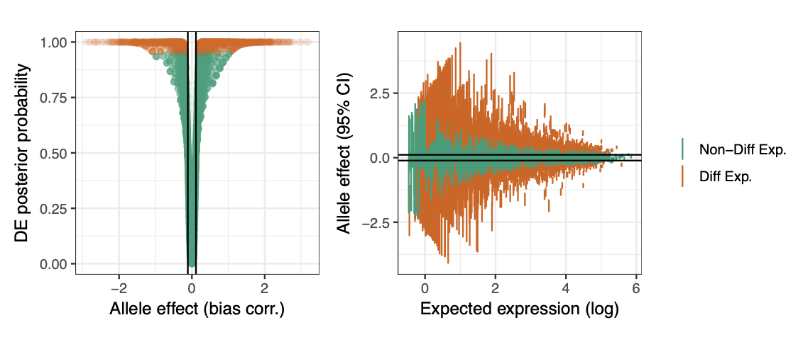

Here are some research producs from my work in IASTATE

{fig-align="center" width=50%}

 

- Fully Bayesian analysis of allele-specific RNA-seq data [link](https://www.aimspress.com/article/10.3934/mbe.2019389)

- Bayesian analysis of high-dimensional count data. (phd dissertation)

- Bayesian inference for a covariance matrix [arXiv](https://arxiv.org/abs/1408.4050)

<!-- https://dr.lib.iastate.edu/entities/publication/a41200c5-a73f-4b20-aefc-ec16ade06724 -->

