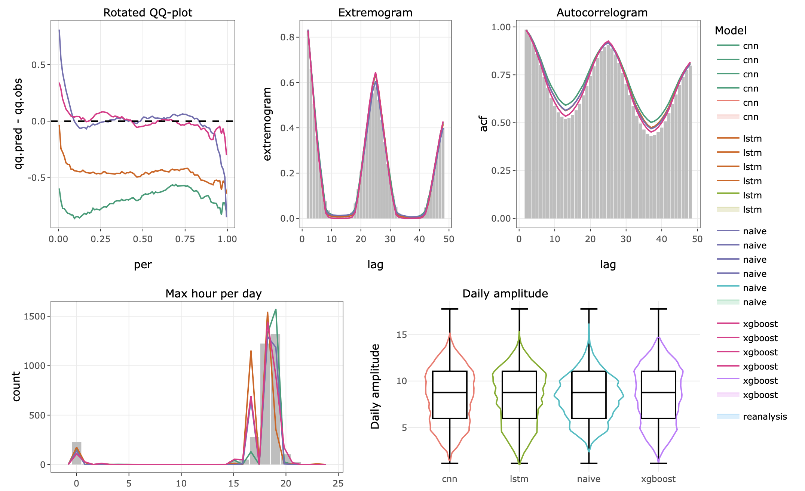

 
In collaborate with [Jairo Cugliari](https://cugliari.github.io/website/) on statistical methods for analyzing climate variables data.  

{fig-align="center" width=50%}

### Statistical downscaling 
Methods to evaluate performance of statistical models used in statistical downscaling. Research grant from ANII

### Temperature series imputation 
Modeling of temepearture long series to describe extreme waves in climate change scenarios. Research grant from ANII

- Modelos bayesianos para series diarias: modelado de temperaturas extremas en Uruguay. [working document](https://hdl.handle.net/20.500.12008/34862) 

- *Workshop*: Métodos Estadísticos para el Análisis de Datos Meteorológicos ([link](https://github.com/nachalca/statClima_FSDA))

