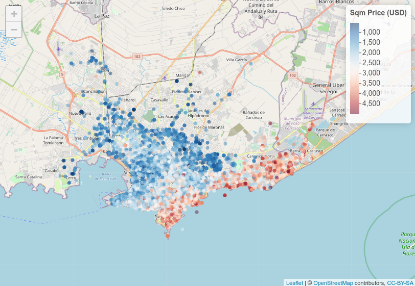

In collaborate with [Natalia da Silva](https://natydasilva.github.io/natydasilva/) on several projects involving machine learning methods, interpretability, and data visualization. 
  

{fig-align="center" width="50%"}

  

### Educational data science 
Create statistical and data science tools with data from Learning Managment Systems (LMS) of [Plan Ceibal](https://ceibal.edu.uy). Research grant from ANII (PI: NAtalia da silva)

- Joint Statistical Meetings 2023 [presentation](https://scholar.google.com/citations?view_op=view_citation&hl=en&user=lxFs2EMAAAAJ&cstart=20&pagesize=80&citation_for_view=lxFs2EMAAAAJ:qxL8FJ1GzNcC)

- Bruno Tancredi's undergrad project: [Aprendizaje estadístico aplicado para potenciar la enseñanza de inglés en primaria: el caso de Ceibal en Inglés en Uruguay](https://www.colibri.udelar.edu.uy/jspui/handle/20.500.12008/44455) 

### Spatial ICE curves  
Combine Individual Conditional Expectation (ICE) curves, spatial constrained clustering, and funcional distances to construct more interpretable ICE curves in spatial probles. Aplications to predictive machine learning modles for Montevideo hausing prices. 

- SpICE: an interpretable method for spatial data. Computational Statistics, 1-21. [link](https://link.springer.com/article/10.1007/s00180-024-01538-6)

- SpICE: Compute ICE curves clusters with geographical constrains and visualization [R package](https://github.com/natydasilva/SpICE)

### Forest value with machine learning 
Prediction modeling for estimate the national forest value accross the world. A project founded by World Bank. 

- Global assessment of non-wood forest ecosystem services: A revision of a spatially explicit meta-analysis and benefit transfer. The Changing Wealth of Nations. [wb document](https://documents1.worldbank.org/curated/en/099101124145545368/pdf/P178446-0f0e245b-cc61-4891-a4ad-38b4c4c8780f.pdf)

### Data Viz competitions 
Contribution to ASA data expo competion, exploring data from survey on selected USA communities. 

- Clicks and cliques: exploring the soul of the community. [link](https://link.springer.com/article/10.1007/s00180-019-00881-3)