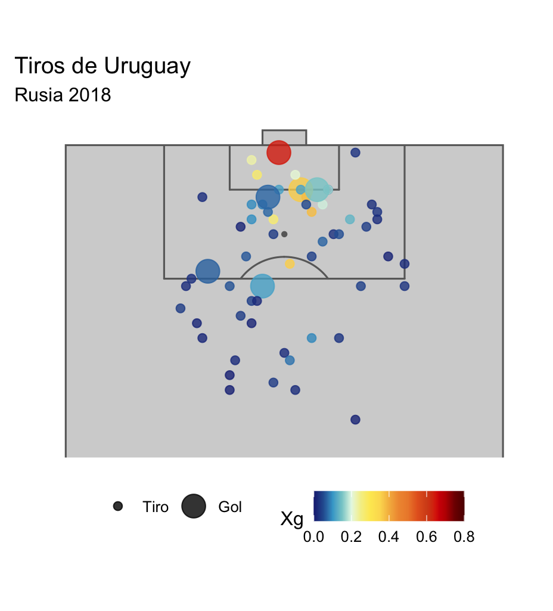

In collaborate with [Andres Sosa](https://iesta.fcea.udelar.edu.uy/integrantes/andres-sosa/) on statistical methods for analyzing data generated in sports competitions or with sport applications. 

 

{fig-align="center" width=50%}

### Football: posesion clusters in world cup
-   Eventing data of football world cups (men and women)
-   Martin Grau's undergrad projet: [*Análisis estadístico de la posesión del balón en los Mundiales de fútbol Catar 2022 y Australia/Nueva Zelanda 2023*](https://www.colibri.udelar.edu.uy/jspui/handle/20.500.12008/51257)   

 

### Teaching 
-   1-semester course for stats majors
-   Goal: introduce statistical methods in sport applications
-   2022 moodle course [website](https://eva.fcea.udelar.edu.uy/course/view.php?id=624)

 

### Uruguay basketball league
-   IESTA [Working document](https://www.colibri.udelar.edu.uy/jspui/handle/20.500.12008/40499)
-   A small [web application](http://164.73.240.157:3838/IESTA-Basket/) using *shiny*
-   we were on [TV](https://sobreciencia.uy/estadisticas-y-basketball-estudios-de-la-facultad-de-ciencias-economicas-sobre-la-liga-uruguaya/)

